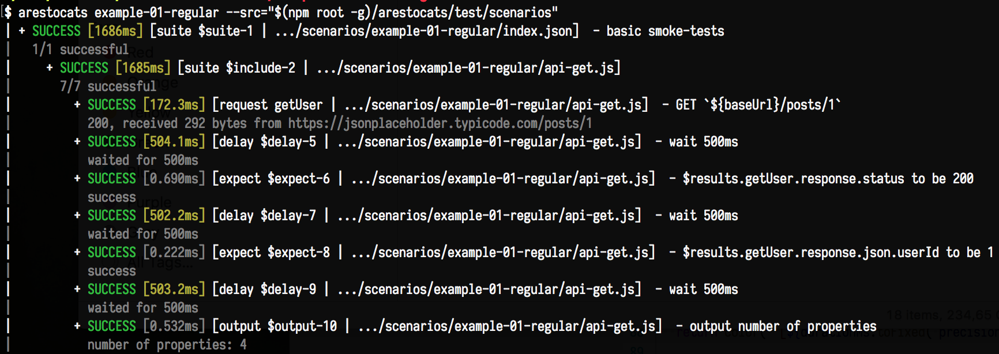
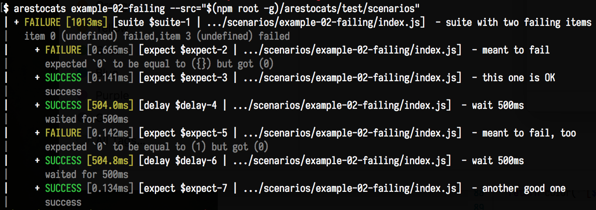
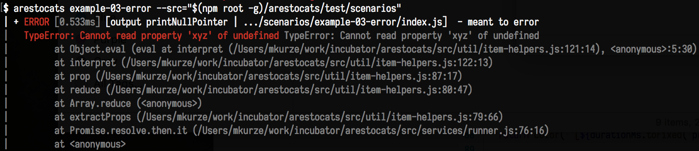
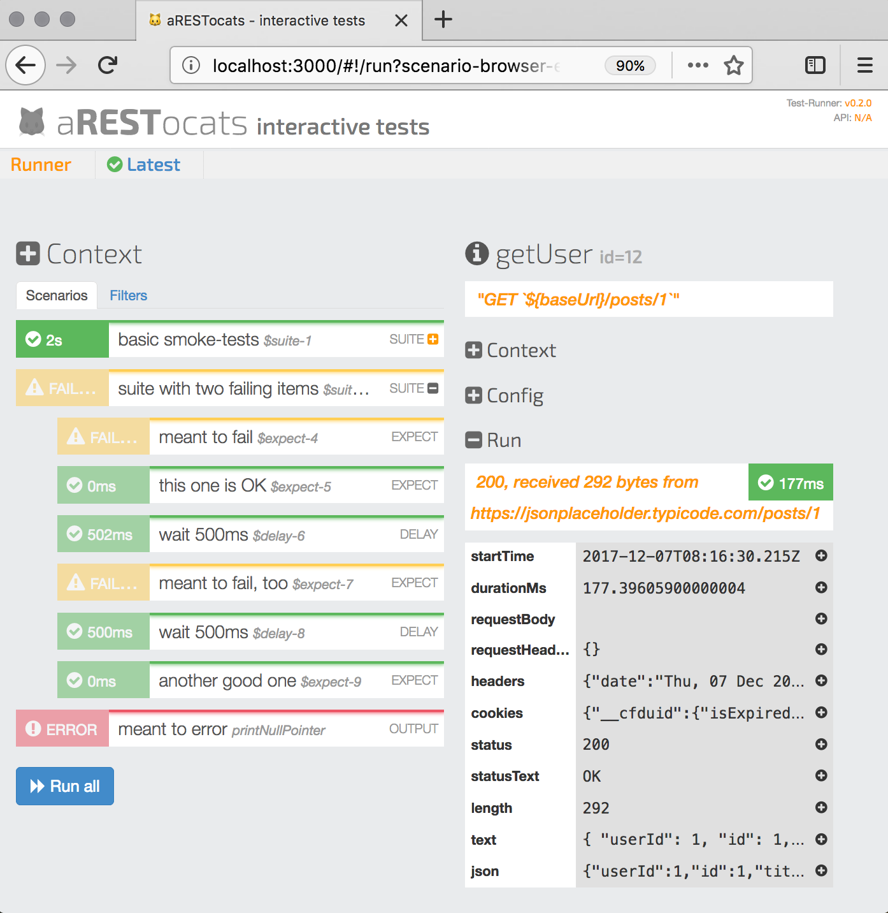

# aRESTocats

> Run declarative integration tests against your REST services

_Note that this project, while already useful, is still maturing and being actively developed._

## Features

With _aRESTocats_ you can

 - tests REST APIs
 - observe the result stream while tests are still running
 - export results as interactive HTML, in csv (compatible with the Jenkins-Plot-Plugin), and/or to a human-friendly standard out format
 - declare tests using simple, composable JSON blocks
 - use builtin plugins:
   HTTP request, delay, expectation checks, OAuth2/JWT login, MQTT, basic load tests, debugging output
 - add custom plugins by implementing a simple JavaScript interface
 - launch tests from the command line, even remotely (through a REST interface)
 - …or interactively through the web interface
 - experiment with test parameters without touching the test files
 - share links to test results, even to individual items, including modified parameters


## Setup

A simple way to get started is to install _aRESTocats_ globally:

```console
> npm install -g arestocats
```

Once familiar, you should probably add aRESTocats as a dev-dependency to the individual projects that you are using it with, and use it from there.
This will provide more control over the version used with each project.


## Usage

Now you may run the `arestocats` command:

```console
> arestocats [scenario1 … scenarioN] [OPTIONS]
```

The test runner will look for the named scenarios in the `./scenarios` root folder by default.
Each scenario is specified by the name of a sub-folder containing an `index.js` or an `index.json` file.
You may change the scenarios root folder using the `--src` option.
If no scenarios are given, all items in the scenarios root folder will be loaded.

The _aRESTocats_ package contains a couple of demo scenarios that run against the publicly available [jsonplaceholder.typicode.com API](https://jsonplaceholder.typicode.com).
These examples illustrate how to make HTTP requests and then check expectations against the respective responses.

For example, to run the first of the demo scenarios included with aRESTocats, run:

```console
> arestocats example-01-regular --src="$(npm root -g)/arestocats/test/scenarios"
```

This should output something like the following result:



To simplify the invocation, let's copy the demo scenarios to our local working directory:

```console
> cp -r "$(npm root -g)/arestocats/test/scenarios" scenarios
> arestocats example-01-regular
```

Now, for an example of a *failing* scenario (where an expectation is not met), run:

```console
> arestocats example-02-failure
```



Or to see an *error* (a test that is broken by itself) in action:

```console
> arestocats example-03-error
```



Finally, to run all demo scenarios:

```console
> arestocats
```

Because the third scenario errors, this will yield an overall outcome of *error.*


### Using the Web Interface

Instead of just running the tests right away, you can start the _web interface._
This will allow users to trigger individual items manually, to tweak configuration, and to share result links.

```console
> arestocats --service
```

Now, visit [http://localhost:3000](http://localhost:3000) for interactive testing:




Currently, the web interface does not automatically reload when you change your test items.
However, you can use a process manager such as [PM2](http://pm2.keymetrics.io/) to achieve this.

Also, for live streaming of results, you currently need a browser that supports [HTTP fetch streaming](https://developer.mozilla.org/en-US/docs/Web/API/ReadableStream#Browser_compatibility), so Google Chrome is currently recommended.


### Creating Test Items

To get started with creating your own test items, the demo items are a good starting point.
Assuming you copied them to a working directory as described above, let's have a look at the successful scenario:

Scenarios are always represented by their _index_ item (`index.json` or `index.js`), just like regular NPM packages.
In case of the `example-01-success` scenario, the JSON format is used:

```json
{
   "type": "suite",
   "description": "basic smoke-tests",
   "defaults": {
      "baseUrl": "https://jsonplaceholder.typicode.com"
   },
   "items": [
      {
         "type": "include",
         "src": "api-get"
      }
   ]
}
```

An aRESTocats _scenario_ is composed of _test items_, with the scenario itself being the top-level item.

Each item has a _type_ ("suite" in this case), which determines the plugin that handles the item declaration.
It may also have a _name_ used to identify item results (does not need to be globally unique), and an informative _description_.
Some item types (like the _suite_ type) support _child items_.

The item type _suite_ is used to compose test items for sequential execution.
If any of the item fails, the suite continues running, but fails overall.
If any of the item errors, the suite errors and aborts.

This suite also has _defaults_ used to set _context options_ for all nested items.
These values can be used in _property expressions_ (see below), e.g. to control which host to make REST API calls to.
You can _set missing_ context options and override pre-configured values from the command-line, like `baseUrl` in this case:

```console
> arestocats example-01-success --context.baseUrl=http://localhost:8000
```

This is useful during development, where you will probably test an API running on your local machine rather than anything that is hardcoded in the scenarios.


### Options

 - `--src=...` to specify a scenarios-root other than `./scenarios`,

 - `--service` to run the REST service (see below),

 - `--service.port=...` to use a non-default port for the web-UI (default: `3000`),

 - `--service.systemUnderTestVersionUrl=...` to specify where the frontend will look for the version resource of the system under test,

 - `--service.developmentProxy` _for development only,_ to forward `/dev` to the webpack-dev-server

 - `--service.developmentProxyTargetPort=...` _for development only,_ if the webpack-dev-server is not listening on 8080

 - `--cli` to enable immediate command-line execution (automatically enabled if REST service is not used),

 - `--cli.reporters=...` comma-separated list of reporters for CLI execution. Available: `stdout`, `csv`, `html` (default: `stdout`),

 - `--cli.wait=<seconds>` how long to wait for launching the initial tests,

 - `--context.myOption=foo` to set the *context option* (see below) named "foo" for all scenarios unless overridden locally.


## Test Definitions Format

Each scenario and each sub-item will be loaded using NodeJS [require](https://nodejs.org/docs/latest-v8.x/api/modules.html#modules_require).
Each test item should be an object with a `type` property, on which most other properties depend.

Here is a list of all general-purpose properties:

- `type` (String) - determines what the test item does (which implementation is used).
  Predefined types: _debug, delay, expect, include, mqtt-publish, output, request, spawn, suite_

- `name` (String) - a name to identify the suite, in the test output, or in order to reference test results from expressions

- `description` (String) - an optional short description

- `defaults` (Object) - allows to specify default values for the _context_ of this item, and of nested items (if applicable, see below)

- `overrides` (Object) - like `defaults`, but taking precedence over any inherited context (see below)

The remaining properties that may be used for an item depend on its type (see below).
These may be specified as _constants_ or as _expressions_:

* An item property is specified as a _constant_ by simply setting it on the item definition (side-by-side with `type`).
The applicable values depend on the property, as long as they can be encoded/decoded to/from JSON.

* An item property is specified as a _property expression_ by prefixing the property name with a colon (e.g. writing `:key` instead of `key`).
The right side of such properties will be expanded by evaluating them as JavaScript, immediately before running an item.
For the evaluation, properties of the _context_ are available, including the special `$results` object that references all previous test results by item name.

Often, items types also have a default that is used for properties that are not defined by an item.


## Run Phases

The API tester runs in multiple phases:


### Pre Phase

The `pre` phase _preprocesses_ the test items into one big JSON-serializable JS object.
Items loaded from external files (using `include`) are inlined into their parent item, and the context for each item is expanded.
The resulting structure may be used to inspect and/or reproduce individual test runs.


### Run Phase

The `run` phase executes test items recursively.

Items may produce _results_ that can be referenced from expressions of subsequent items using the `$results.name`, where `name` is the name of the respective producing item.
For example, this allows you to `expect` properties of a `request` item response.
When items have the same name, only the result of the *most-recently run* can be referenced.


### Report Phase

The `report` phase processes and outputs test results, using all of the configured reporters.


## The Run Context

During preprocessing, test items receive a _context_ (a map of strings) from _above_, i.e. from their parent tests or from command line options.
Some types of test items (`suite`, `include`) may contain or reference _nested items_: they pass down their _context_ to these items.
If you think of a test plugin as a small program, the context properties correspond to environment variables, while the regular item (expression) properties correspond to (interpolated) command line arguments.

Test items may specify `defaults` for context properties (as a JS object), which are overwritten by context inherited from above.
Additionally, test items may specify `overrides` (also as an object), changing the context inherited from above for themselves and for their nested items.
All other properties will only be available to the items themselves when run, and are not part of the inheritance context.

Note that there is no actual sandboxing in place! So security-wise you should treat aRESTocats scenarios just like you would regular executable code. However, this should not be much of a surprise because test items are usually defined in `.js` files.

Also, test items may (sometimes must) have a `name` for reference purposes.
This name is not required to be globally unique, but should be unique within specific contexts (e.g. for members of a `suite`).


### Context Properties: `role`

The `role` is an optional string property that can be used to indicate the purpose of an item:

- `"prepare"` - this item is required as setup or precondition for a subsequent test item
- `"test"` *(default - do not manually specify)* - this item is itself a test
- `"cleanup"` - this item is needed for cleanup.

This distinction is helpful to create UI representation of test item trees.
Because the role is part of the context, it is automatically inherited by nested items.

*Note:* currently, cleanup items are not run if a preceeding item *errors*!


## Test Results

Each test item produces a _result_ (wrapped in a promise) when run.
A result is an object with an `outcome` and (optionally) additional properties.

*Result* Outcome

The `outcome` (a string) is one of the following:

- `SUCCESS` - item passed, everything good
- `SKIPPED` - item was skipped, e.g. because it came after an ERROR item
- `FAILURE` - item failed, e.g. an expectation was not met, or a server did not respond
- `ERROR` - an unexpected error happened, e.g. a programming error

The difference between `ERROR` and `FAILURE`:

- _Errors_ indicate programming problems that need to be fixed in the test definition or in the test runner itself.
  Examples include missing context configuration or syntactically invalid expressions.

- _Failures_ indicate that some expectation of the test was not met.
  Either the expectation is mistaken, or the system under test is in violation.

The runner will automatically set the outcome `ERROR` for items that throw an exception or that reject their result promise.

Results may be referenced from property expressions of subsequent items.
E.g. the status code of a `request` item named `myRequest` is accessible under `$results.myRequest.response.status`.
When there are multiple items of the same name, latter results simply shadow prior results, making them unavailable for reference.
In practice, this works because you should only reference results from items of the same suite.
The reporting is based on item-IDs generated during the pre phase, so it will still contain all results.


### Result Message

Results may contain a `message` string with additional human-audience information.


### Result Failures and Error

If the outcome is `FAILURE`, there should be a `failures` array of strings, explaining each violated expectation.
If the outcome is `ERROR`, there should be an `error` object, preferably an exception instance.


### Result Duration

The test runner adds a field `durationMs` (Number) to each result, containing the duration of an item execution in milliseconds.
This can be used in subsequent expectations, for example to check performance requirements.
It is also the number occuring in the colored CLI output.


## Test Item Types

The following item types are available out-of-the-box.
For each item type, the applicable configuration properties and context variables are listed here.
Properties marked as *(pre)* are evaluated during the preprocessing phase.
This means that they cannot refer to any `$results` if set using expressions.


---
### `assign` - compute custom results

Use this to assign an expression value to the item result value, or to copy properties to the result.
Usually, this is used to create shortcuts into deeply nested JSON response documents.

#### `assign` plugin: Configuration Properties

- `value` (*)

   *this value will be stored in the result under the key `value`*

- `properties` (Object)

   *properties of this object will be copied over to the result*

#### `assign` plugin: Result Properties

- `value` (*)

   *the (evaluated) `value`*

- `*` (*)

   *the properties of the (evaluated) `properties`*


---
### `delay` - wait for some time

Use this to allow for an external process to complete.
Useful if the system under test imposes rate limits, e.g. for login attempts.

#### `delay` plugin: Configuration Properties

- `milliseconds` (Number) - wait duration


---
### `expect` - check expectations

After making one or several requests, usually there are expections on the results.
For this, the `expect` type is used.

#### `expect` plugin: Configuration Properties

- `value` (any)

  *what to check, usually given as an expression (e.g. `$results.myRequest.durationMs < 100`)*

- `expected` (any)

   *the value that is expected. If omitted, the value is checked for "truthiness"*

- `matches` (any)

   *a regular expression whose value should match the actual value. If given, `expected` is ignored*

- `strict` (Boolean, default `false`)

  *determine if comparison is using `==` (relaxed) or `===` (strict)*

#### `expect` plugin: Result Properties

- `actual` (any) - the actual evaluation result


---
### `include` - embed externally defined items

During the `pre` phase, this item is replaced with the (preprocessed) test item obtained by using `require` on the given path.
If `options` are specified, they are inherited by the included item.
This means that the same suite may be used multiple times, each time with different options.

#### `include` plugin: Configuration Properties

- `src` (String) - path to a test item module.
  If relative, the path is resolved based on the including file *(pre)*


---
### `load` - perform load-testing on a service

Make a lot of requests to a given URL, and track how quickly each response arrives.
Load-tests are based on the NPM library [loadtest](https://www.npmjs.com/package/loadtest).
Because NodeJS is single-threaded, this is not as powerful as a dedicated load-tester such as [JMeter](http://jmeter.apache.org/).
However, this is still useful to simply measure and monitor API performance against significant regressions.

#### `load` plugin: Configuration Properties

 - `url` (String)

   *the URL to make the request to*

 - `agentKeepAlive` (Boolean, default=true)

   *instruct the `laodtest` library to use keep-alive connections. Use `false` to open a new TCP connection for each request*

 - `body` (String, default=null)

   *a request entity to be sent to the server, usually as part of POST or PUT requests*

 - `cookies` (String, default={})

   *named cookies to send to the server using an additional header. Note that a name/value object is expected just like for the `request` item and not a list of key/value-pairs as used internally with the `loadtest` library*

 - `concurrency` (Number, default=10)

    *target number of concurrently open requests*

 - `expectedStatus` (String, default='xxx')

    *status code pattern to expect (use 'xxx' to ignore)*

 - `expectedType` (String, default=null)

    *expected content type. If set, it is used for the Accept-header and to check the responses*

 - `expectedRps` (Number, default=null)

    *the average number of requests per seconds that must at least be processed. Measurement starts at first request and ends when `maxRequests` responses have been received, or `maxSeconds` has elapsed `headers` (Object, default={}) named request headers to send, use `;` to specify multi-valued headers*

 - `jsonBody` (Object, default=null)

    *an object to be converted to a JSON request entity, usually as part of POST or PUT requests. If given, this takes precedence over the body. If `null`, no entity is sent*. Automatically causes a JSON content type if used

 - `maxRequests` (Number, default=10000)

    *the target number of requests that must be completed for the test to SUCCEED*

 - `maxErrorPortion` (Number, default=0)

   *allows to set a tolerance for errors*

 - `maxSeconds` (Number, default=10)

   *the test will always be canceled after this period, and will *FAIL* if fewer than `maxRequests` have been completed*

 - `method` (String, default='GET')

   *the HTTP verb to use*

 - `pollForMS` (Number, default=0)

    *if this is not null, repeatedly poll the resource until `expectedStatus` is returned. The result will be set to the last response*

 - `pollDelayMS` (Number, default=100)

    *how often to poll if `pollForMs` is specified*


#### `load` plugin: Result Properties

 - `details.errorCodes` (Number)

   *for each encountered error codes, the number of responses (if any)

 - `details.maxLatencyMs` (Number)

   *slowest response time

 - `details.minLatencyMs` (Number)

   *fastest response time

 - `details.percentiles` (Object)

   *a upper latency bounds for the fastest X (X="50"/"90"/"95"/"99") percent of requests

 - `details.rps` (Number)

   *average requests per second during the run

 - `details.totalRequests` (Number)

   *number of requests completed

 - `details.totalTimeSeconds` (Number)

   *duration of the load test in seconds


---
### `mqtt-publish` - publish a message over MQTT

Connects to an MQTT broker and tries to publish a message.

#### `mqtt-publish` plugin: Configuration Properties

- `topic` (String)
- `message` (String)
- `connectTimeout` (Number, default `500`)


---
### `output` - generate diagnostic result

Generates a message based on the `value` property. Never fails, but may error if a property expression produces an error.

#### `output` plugin: Configuration Properties

- `value` (any) - what to output
- `label` (String, default `"output"`) - an informative prefix


---
### `request` - make an HTTP request, store the response

Make a request to a given URL, and store response information in the result (under the `response` key).

#### `request` plugin: Configuration Properties:

- `url` (String)

   *the URL to make the request to*

- `body` (String, default: null)

   *a request entity to be sent to the server, usually as part of POST or PUT requests*

- `checkLength` (Boolean, default: `true`)

   *if true, verify that any advertised Content-Length matches the actual response length*

- `cookies` (Object, default: `{}`)

   *named cookies to send to the server using an additional header*

- `expectedStatus` (String, default: `"2xx"`)

   *status code pattern to expect (use 'xxx' to ignore)*

- `expectedType` (String, default: `application/json`)

   *expected content type. Used to check the response. If this is `application/json` or any `application/...+json` type, the response body is parsed as JSON and stored as field `json` within the results. This is also used for the `Accept` header if none is specified.*

- `headers` (Object, default: `{}`)

   *named request headers to send. If no `Accept` header is given, one is automatically added based on the `expectedType` parameter (if set)*

- `limit` (Number, default: `255`)

   *maximum prefix of text responses to keep in the result, null for "no limit"*

- `method` (String, default: `"GET"`)

   *the HTTP verb to use*


#### `request` plugin: Result Properties

- `response.cookies` (Object)

  *values from the 'set-cookie' headers, grouped by name*

- `response.headers` (Object)

  *response headers, with names lowercased*

- `response.json` (Object)

   *for responses of JSON content-type, the parsed representation, else `null`*

- `response.length` (Number)

   *the number of characters of the decoded response body*

- `response.status` (String)

   *the HTTP response status code*

- `response.text` (String)

   *response contents, up to the specified limit in length*


---
### `suite` - define a suite of tests

Used to create sequences and hierarchies of test items.
Any context applied to a suite will be applied to all children.

#### `suite` plugin: Configuration Properties

- `items` (Array)

  *an array of nested test items (which may in turn also be suites)* (pre)

#### `suite` plugin: Context Properties

- `skipAfter` (String, default: `"ERROR"`) if the given outcome or worse is encountered during suite processing, any remaining items are skipped

Items in a suite are run in sequence, but should be considered separate tests, not affecting each other.

#### `suite` plugin: Result Properties

Suites generate a compound result, using the `nested` field for their children results.
The suite _outcome_ is always the worst outcome produced by any child.


## Development

First, `git clone` this repository, and `cd` into it.

Then run:

```console
npm install
```

to obtain the dependencies, and to bundle the web frontend.

### Development: Web Frontend Setup

The folder `frontend` contains a [LaxarJS](https://laxarjs.org) web frontend for running tests and for inspecting results.

It is automatically installed when you `npm install` aRESTocats.

To develop the frontend itself, you will want to run the Webpack development server:

```console
> # start webpack in the background
> ( cd frontend ; npm start ) &
> # then, run the REST API and a proxy for the frontend:
> npm start -- \
   --service \
   --service.developmentProxy
```


You may also specify individual scenarios, or the `context` options, just like you would for command-line execution.


